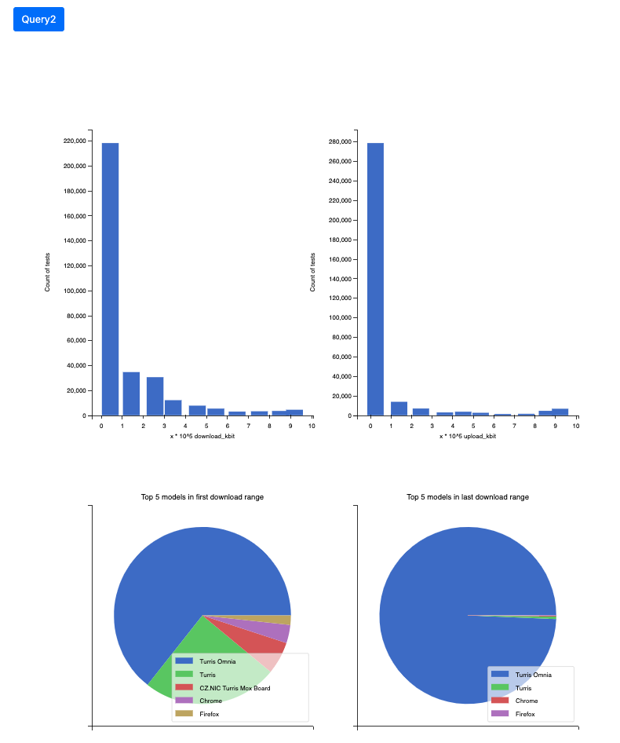
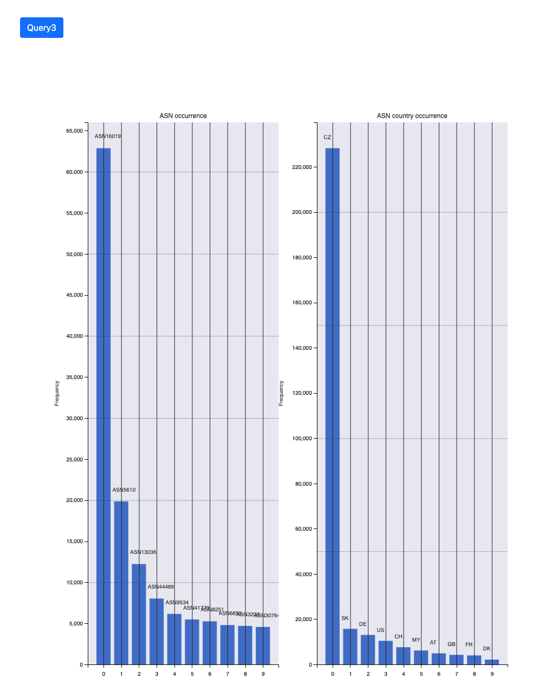

# UPA - Project
Object: Collect data about internet connection measurments from one czech provider. Clean and prepare data to load it into the NoSQL DB, then collect the subset of data into SQL DB and create the statistics plots about subset of cleaned data. In this case, the used NoSQL DB is MongoDB and SQL is PostgreSQL. 
The created plots are about: 
    1. Box plots for download, upload, ping, IP subnet.
    2. Plot about aggregating the users by the speed and thier common devices
    3. Plot about aggregating the users by the ASN, most common countries in which ASN resides 


# UPA - Projekt slovensky popis


## Zadanie
5. Rychlost internetového připojení


## Zvolené dotazy
A   -   vytvorte popisné charakteristiky pro měřené hodnoty download, upload a ping pro
zvoleného uživatele či síť (IP prefix); využijte krabicové grafy, histogramy, atd.

B   - seskupte uživatele podle rychlosti jejich připojení (v intervalech) a určete společné a
rozdílné vlastnosti jednotlivých skupin

C   -   zoskupte užívateľov podľa ASN a vyhodnoťte najčastejšie ASNs vyskytujúce sa v dat
a setoch a zároveň najčastejšie krajiny, v ktorých sú jednotlivé ASNs zaregistrované


## Spustenie projektu

#### Požiadavky pred spustením
- `Docker`
- `docker-compose`

Nasledujúce príkazy je potrebné spúšťať v koreňovom adresári projektu.


- Ako prvé treba spustiť Docker kontajner, v ktorom bežia databázy, webový server a
aplikácia. 
```shell 
docker-compose up
```

- Po spustení databáz a webového servera je možné nahrať všetky dáta do databázy. Pre
spustenie jednotlivých krokov samostatne, je možné využiť aplikáciu `runner.py`

#### Spúšťacia aplikácia

- Stiahnuť dáta z určitého časového rozmedzia

```shell
docker-compose exec app python runner.py download_data_in_range [--start-month INT --start-year INT --end-month INT --end-year INT]
```

- Načítať stiahnuté dáta do Mongo databázy a dáta zo špecifikovaného časového rozmedzia do  Postgre databázy

```shell
docker-compose exec app python runner.py init_both_databases [--start-month INT --start-year INT --end-month INT --end-year INT]
```

- Zobrazenie všetkých možností

```shell
docker-compose exec app python runner.py --help
```


## Popis implementácie

Dáta sú získavané z NetMeter. Tie sú následne spracované a upravené pre naše konkrétne
požiadavky. Vo forme CSV následné nahrané ako Pandas dataframes a na nich je vykonávané
čistenie. V tomto kontexte, máme obrovské množstvo platných dát takže nemám zmysel dopĺňať
hodnoty ako download, upload a ping a preto dáta, ktoré neobsahujú tento atribút
zahadzujeme.  


Pre NoSQL databázu bola zvolená technológia MongoDB a pre relačnú databázu bolo zvolené
PostgreSQL. V MongoDB sú uložené len tie dáta, ktoré sú využívane pri dotazoch. To je
`open_uuid`, `open_test_uuid`, `download_kbit`, `upload_kbit`, `ping_ms`, `asn`,
`ip_anonym, speed_test_duration_ms`, `network_type`, `model`. _network\_type_ a _model_ sú
používané pre dotaz B pretože pri spoznávaní datasetu sme zistili, že majú najvyššiu
početnosť a teda ich obsahujú takmer všetky dáta a dostatočne hovoria o nejakej vlastnosti
daného testu. Model vyjadruje reťazec zariadenia na ktorom bol test vykonaný a
_network\_type_ zase predstavuje typ siete ako WLAN, LAN, ktorá bola použitá na test.
_open\_test\_uuid_ by malo podľa netmetru mať formát UUID a teda jeho unikátnosť patrične
využívame v relačnej databáze ako primárny kľúč. 

Pri prevode dát z MongoDB do PostgreSQL sú vybraté len potrebné údaje a ku nim získaný
kód krajiny pre ich konkrétne ASN. Kód krajiny sa získava z RIPE API a je priradený do
tabuľky pre ASN, ktorá je priradená ku každej tabuľke testovania s rovnakou ASN. Dáta
z MongoDB sú získána na základe časového obdobia, poskytnutého užívateľom.


Pri získavaní dát z RIPE API bol zistený problém s rýchlosťou získavania kódu krajiny pre
každé jedno dato. Jeden dotaz trval viac ako 1 sekundu, čo je neprijateľné pre naše
množstvo dát, kvôli tomu bolo získavanie implementované pomocou asynchrónnych funkcií.


Dáta pre dotazy sú vybrané z PostgreSQL databázy priamo v nej a v python aplikácii vizualizované
pomocou `matplotlib` knižnice do grafov. Grafy sú transformované do html podoby cez
knižnicu `mpld3` a zobrazené na vlastne API na `localhost:8000`. 

Pri poslednom kroku dotazov, transformácie grafov do html sa objavil problém s knižnicou
`mpld3`, ktorá nepodporuje všetky funkcionality `matplotlib` čo skomplikovalo upravovanie
vzhľadu grafov.


## Popis získaných výsledkov

### Dotaz A


Pri tomto dotaze boli vytvorené popisné charakteristiky pre každého užívateľa s hodnotami
`download`, `upload` a `ping`.

### Dotaz B


Dotazom B sa zistilo, že veľká časť užívateľov patrí do jedného rozmedzia rýchlosti
sťahovania a nahrávania. Väčšina užívateľov nemá rýchlejšie pripojenie ako 999999 kbit.

Najčastejšie použité zariadenie na meranie rýchlosti je Turis Omnia, tieto zariadenia
patria pod CZ.NIC a pravdepodobne majú testovanie rýchlosti pripojenia na NetMeter nastavené ako
predvolené. 

### Dotaz C


Dotaz C ukázal podobný vysoký rozdiel jednej hodnoty ako predošlý dotaz. Česko ako krajina, pod
ktorou je zaregistrované ASN, bola až 11-krát častejšia ako druhá krajina v poradí,
Slovensko.

Pri konkrétnych ASN prevláda Vodafone CZ a nasleduje ho s 3-násobne menším počtom O2 CZ.
